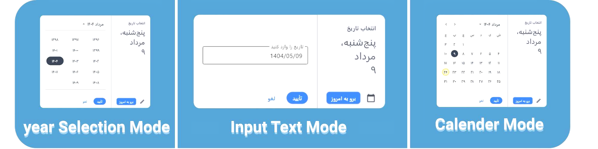
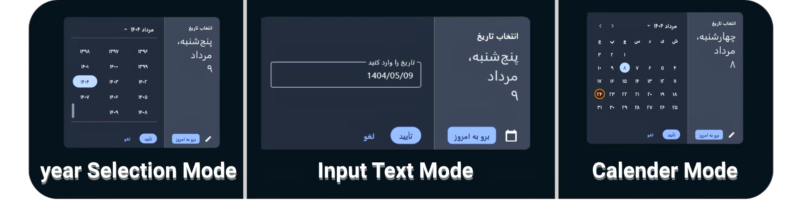

# Flet Persian DatePicker

[🇬🇧 English](README.md) · 🇮🇷 فارسی

یک ویجت انتخاب‌گر تاریخ فارسی (جلالی/شمسی) برای [Flet](https://flet.dev)، که از پایه ساخته شده تا از نظر ظاهر و تجربه کاربری مشابه `DatePicker` داخلی Flet باشد، اما با پشتیبانی کامل از تقویم فارسی و راست‌به‌چپ (RTL).

## معرفی
`DatePicker` داخلی Flet فقط از تقویم میلادی و متن انگلیسی پشتیبانی می‌کند، که آن را برای کاربران فارسی‌زبان نامناسب می‌سازد. این پکیج یک جایگزین با API مشابه ارائه می‌دهد که کاملاً روی ویجت‌های موجود Flet ساخته شده است. ویژگی‌های کلیدی:
- **پشتیبانی از تقویم جلالی**: مدیریت صحیح سال کبیسه، نام‌های ماه و روز فارسی، اعداد فارسی.
- **ناوبری با صفحه‌کلید**: Enter برای تأیید، Escape برای لغو، جابه‌جایی روز/هفته، که همگی هنگام تایپ در حالت ورودی به‌طور خودکار غیرفعال می‌شوند.
- **حالت ورودی با اعتبارسنجی**: تاریخ را مستقیماً تایپ کنید (با اعداد فارسی یا انگلیسی) با بررسی فرمت و محدوده.
- **تم‌های روشن/تاریک** و محدوده سال قابل تنظیم.
- کاملاً با ویجت‌های موجود Flet ساخته شده، بدون وابستگی به رابط کاربری خارجی.

## نصب
نصب پکیج از طریق pip:
```bash
pip install persian-datepicker
```
نیازمند **Python 3.10+** و **Flet 1.0+** است (`pip install "flet>=1.0.1,<2"`).

> ### ⚠️ سازگاری با نسخه Flet
> نسخه **2.0.0 و بالاتر** این کتابخانه برای **Flet 1.x** (نسخه 1.0.1 به بالا) ساخته شده است و روی **Flet 0.x** کار نمی‌کند، چون Flet 1.0 بسیاری از API‌ها را تغییر نام داده یا حذف کرده است.
>
> اگر پروژه شما هنوز روی **نسخه قدیمی Flet** (0.28.x یا قدیمی‌تر) است، لطفاً یک **نسخه قدیمی‌تر از این کتابخانه** را نصب کنید که با همان نسخه Flet هماهنگ است:
> ```bash
> pip install "persian-datepicker<2" "flet<1"
> ```
> به‌طور خلاصه: **Flet جدید ← کتابخانه 2.x**، **Flet قدیمی ← کتابخانه 1.x**.

## شروع سریع
```python
import flet as ft
from persian_datepicker import PersianDatePicker

def main(page: ft.Page):
    datepicker = PersianDatePicker()

    def handle_result(result):
        if result:
            print(f"Selected: {result['formatted_persian']}")

    datepicker.set_result_callback(handle_result)

    def show_datepicker(e):
        datepicker.show(page)

    page.add(ft.Button("Select Date", on_click=show_datepicker))

ft.run(main)
```
این کد را پس از نصب پکیج اجرا کنید تا یک انتخاب‌گر تاریخ ساده به همراه دکمه‌ای برای باز کردن آن ببینید. تاریخ انتخاب‌شده به فرمت فارسی چاپ می‌شود.

## استفاده پیشرفته
- تنظیم محدوده سال دلخواه: `PersianDatePicker(first_year=1400, last_year=1410)`.
- تنظیم تاریخ پیش‌فرض: `datepicker.set_default_date(jdatetime.date(1404, 6, 1))` — این متد یک شیء `jdatetime.date` می‌گیرد، نه رشته متنی.
- باز کردن در ماه/سال مشخص: `datepicker.show(page, display_year=1403, display_month=6)`.
- غیرفعال کردن حالت ورودی یا پشتیبانی صفحه‌کلید: `PersianDatePicker(enable_input_mode=False, keyboard_support=False)`.

برای مشاهده تمام گزینه‌های بالا به `examples/example_basic.py` مراجعه کنید و برای یک برنامه کوچک برنامه‌ریز رویداد ساخته‌شده با این ویجت، به `examples/example_mini_project.py` نگاه کنید.

## تست
این پروژه از `pytest` برای پوشش منطق محاسبات تاریخ و اعتبارسنجی (سال کبیسه، عبور از مرز ماه/سال، تجزیه ورودی) استفاده می‌کند.

نصب وابستگی‌های تست و اجرای مجموعه تست‌ها:
```bash
pip install -e ".[dev]"
pytest tests/
```

## تصاویر
Persian DatePicker را در عمل ببینید:

- **حالت روشن**:

<div align="center">
  
</div>

- **حالت تاریک**:

<div align="center">
  
</div>

## تاریخچه تغییرات
برای مشاهده تاریخچه نسخه‌ها به [CHANGELOG.md](CHANGELOG.md) مراجعه کنید.

## مشارکت
باگی پیدا کردید؟ آن را در [https://github.com/AliAminiCode/flet-persian-datepicker/issues](https://github.com/AliAminiCode/flet-persian-datepicker/issues) گزارش دهید.
توسعه‌دهنده: [Ali Amini](mailto:aliamini9728@gmail.com).
تحت مجوز [MIT License](https://github.com/AliAminiCode/flet-persian-datepicker/blob/master/LICENSE).